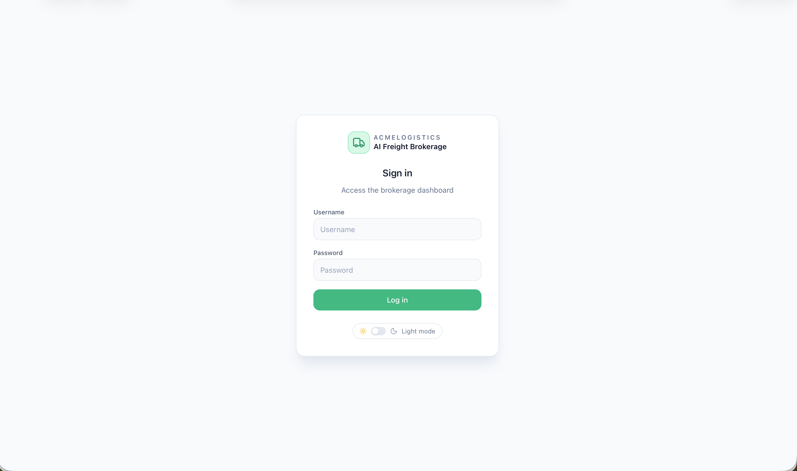
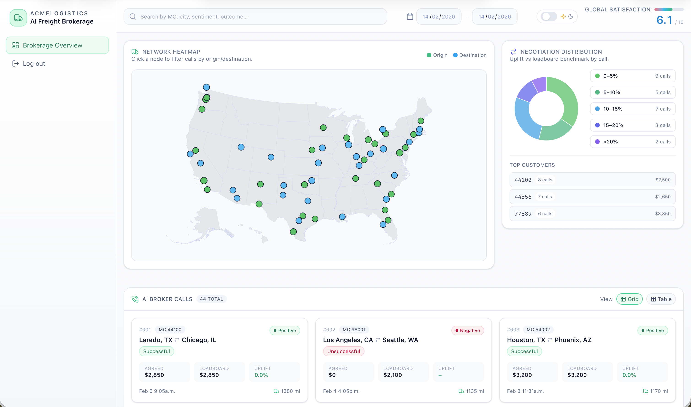
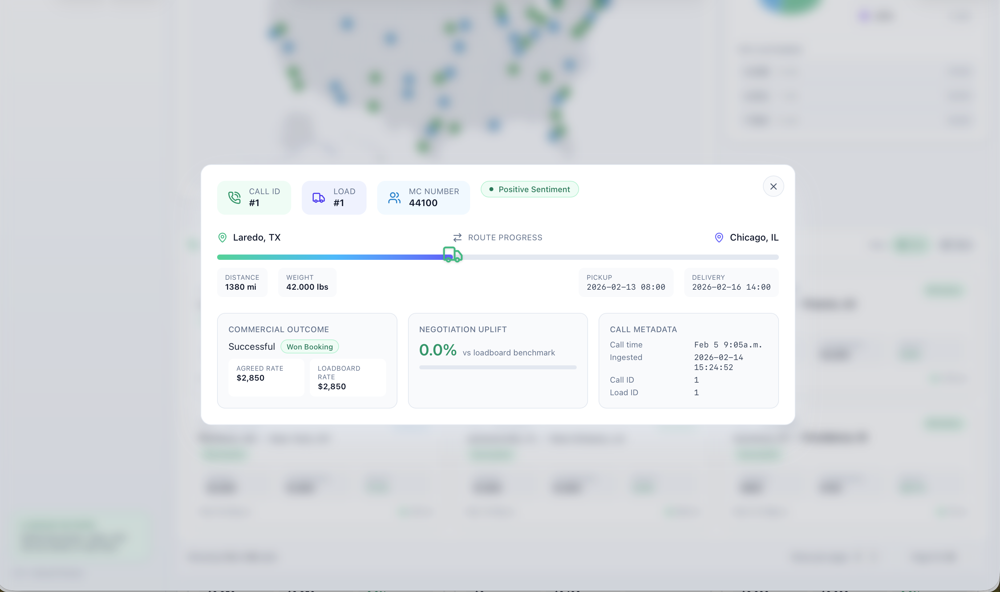
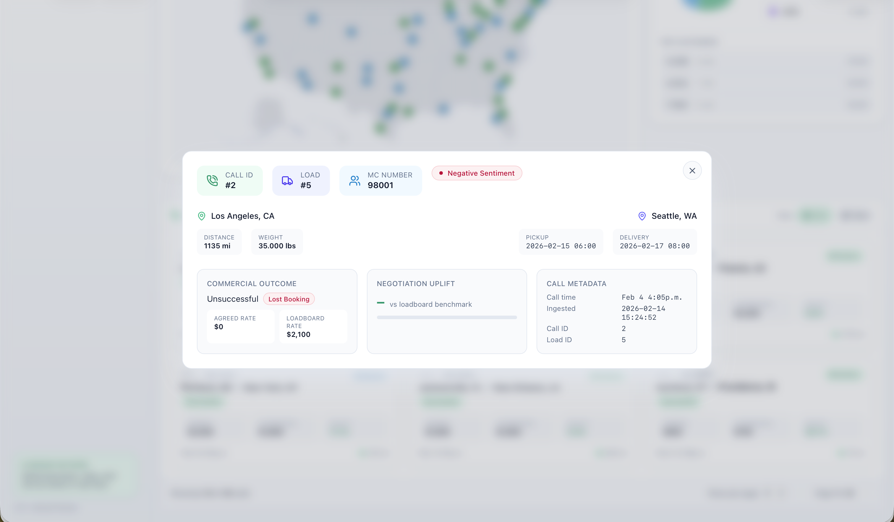
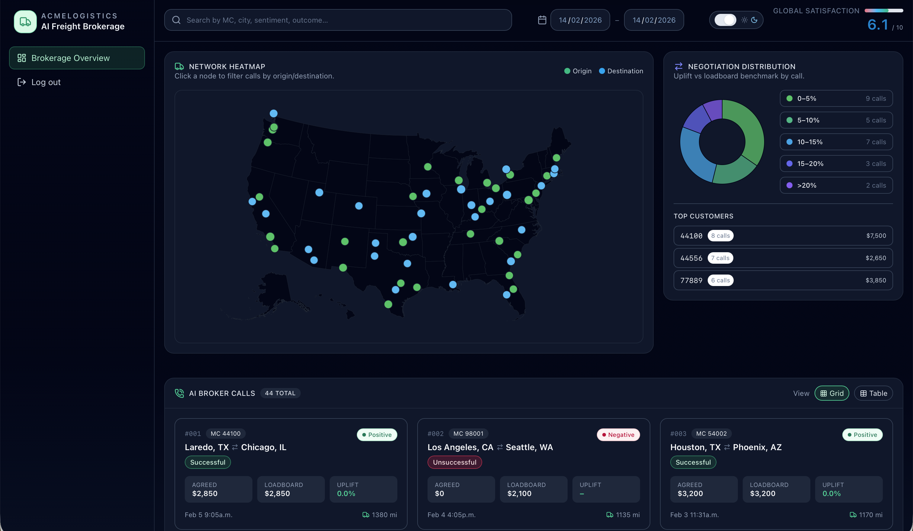

## Acme Logistics: AI Voice Broker & Analytics Suite

This repository contains an end-to-end solution for freight brokerage automation, featuring an Intelligent Voice Agent with negotiation capabilities and a real-time Call Analytics Dashboard.

### Prerequisites
Before deploying, you must configure your environment variables. This project uses a centralized configuration file to manage API keys and credentials.

Create a file named env.sh in the root directory and fill it with the following:
```bash
export TF_VAR_authorization_bearer="AUTH-BEARER-HERE"
export TF_VAR_fmcsa_api_key="FMCSA-API-KEY-HERE"
export TF_VAR_docker_username="DOCKER-USERNAME-HERE"
```

> **Note:**  
> Always run source env.sh before building images or initiating any deployment process.

### Data Population
For both deployment options, the internal SQLite database is automatically populated upon initialization using the following files:

- `data/loads.csv`: Current available freight shipments.

- `data/calls.csv`: Historical call logs and interaction data.

## Option 1: Local Deployment
We utilize Nginx as a secure gateway to handle incoming traffic:
1. Nginx manages the certificates signed by Let's Encrypt, decrypting traffic before it reaches the application.
2. The FastAPI application runs in an isolated Docker network (app-internal). It is exposed on port 8888 only to the proxy.

### Deployment
1. Place your `fullchain.pem` and `privkey.pem` inside the `./reverse-proxy/` folder.
2. Run: 
```bash
docker compose up --build
```

## Option 2: Cloud Deployment
**Geographic Restriction (US Regions Only)**: The cloud instance MUST be deployed within a United States region (e.g., eastus, centralus).

The FMCSA API (Federal Motor Carrier Safety Administration) restricts access to US-based IP addresses. Deploying in European or Asian regions will result in failed carrier MC validations.

### Docker Hub Workflow
1. Login: 
```bash
docker login -u $TF_VAR_docker_username
```
2. Build:
```bash
docker build -t $TF_VAR_docker_username/happy-robot-api:latest .
```
3. Push:
```bash
docker push $TF_VAR_docker_username/happy-robot-api:latest
```

Once the image is pushed, use Terraform to provision the resources in a US region:
```bash
terraform init
terraform apply
```

## Call Outcomes & Tracking
The system automatically characterizes interactions into three states, reflected in the dashboard:
- Successful: Price agreement reached.
- Unsuccessful: MC verified, but negotiation failed.
- MC Invalid: Carrier identity could not be validated.

Login Page:


Dashboard Full View:


Successful Call


Unsuccessful Call


Dashboard Night Mode:
